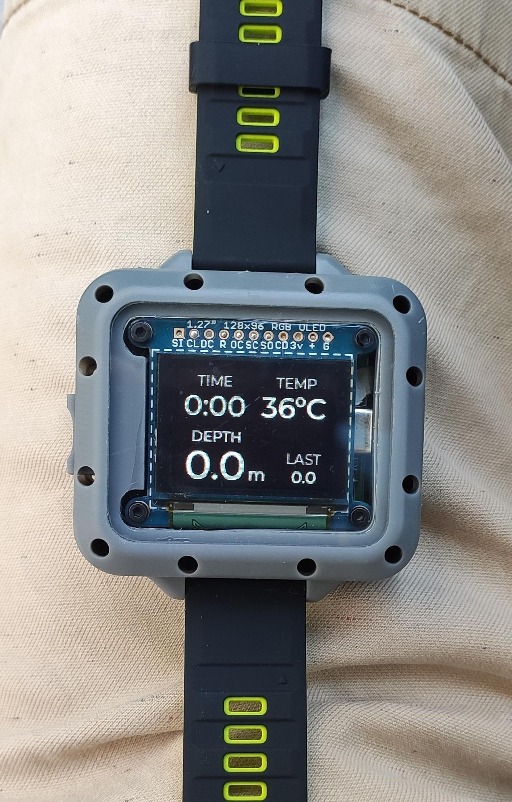
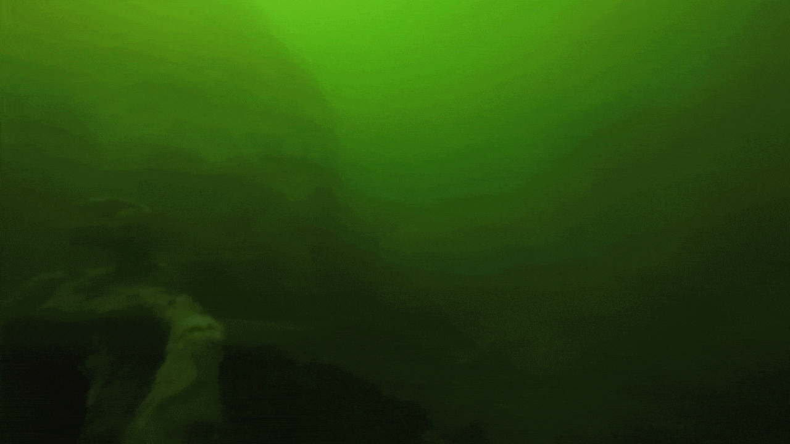
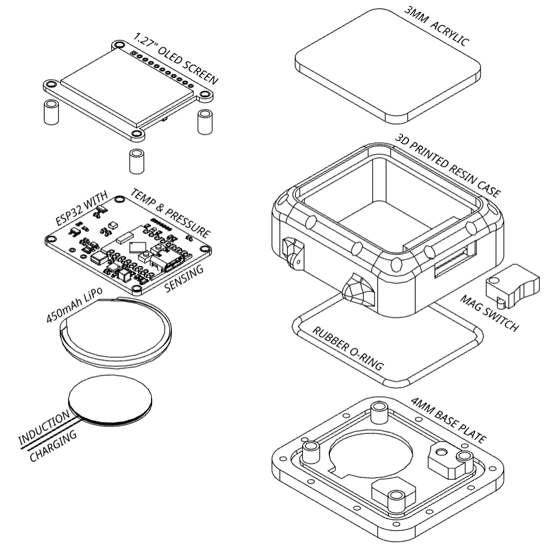

# Freediving Computer (PoC)

<p align="center">
  
</p>

A freediving computer prototype I built to test two main ideas: **tap navigation via accelerometer** and **wireless charging** in a completely sealed case.

As a maker, making waterproof buttons and moving parts that survive water pressure without leaking is nearly impossible. To avoid leaks, I skipped physical buttons and external connectors entirely:
1. **Tap navigation** — tapping the case scrolls and selects menus; the accelerometer detects the shock direction.
2. **Wireless charging** — sealed inside the case with an LTC4120 receiver, powered by a custom induction dock.
3. **Magnetic power switch** — an external magnet disconnects the battery so it doesn't drain when stored.
4. **Custom 4-layer PCB** — designed around the form factor of an off-the-shelf color OLED module.

> **Status**: This V1 worked and proved the concept in water. I am now working on a **V2** that is more compact, with better integration and extra freediving features.

---

## Demo

<p align="center">
  
</p>

<p align="center"><em>Tap-based navigation through the interface — accelerometer detects directional impacts on the casing.</em></p>

<p align="center">
  
</p>

<p align="center"><em>Live depth tracking during a test — automatic dive detection and surface recovery timer.</em></p>

---

## Key Features

| Category | Details |
|---|---|
| **Depth & Temperature** | Real-time tracking via MS5837-30BA (±2 mm resolution, 300–1200 hPa). Automatic fresh/salt water density compensation. |
| **Dive State Machine** | Auto-triggers at 1.0 m depth. Tracks dive time, max depth per dive, and session statistics. |
| **Surface Recovery Timer** | Starts automatically on surfacing. Color-coded: red until 2× dive time, then green. Auto-hides after 10 min. |
| **Session Statistics** | Max dive time, max depth, total dives, and device run time — all tracked per session. |
| **Tap Navigation** | LIS2DUX12 accelerometer detects directional taps on the casing. Left/right to scroll, down to select. No buttons, no dynamic seals. |
| **Magnetic Battery Cutoff** | Integrated magnetic switch isolates the LiPo battery with an external magnet (true 0 µA shelf storage while sealed). |
| **Wireless Charging** | Completely sealed enclosure — power delivered through the case via LTC4120 wireless power receiver. |
| **Display** | 1.27" SSD1351 color OLED (128×96), driven over SPI with DMA. LVGL handles 60 fps animated transitions. |
| **Battery Monitoring** | ADC with hardware calibration curve. Voltage divider maps LiPo range (3.0–4.2 V) to percentage. |
| **Deep Sleep** | Full power-off via menu. GPIO wakeup from accelerometer interrupt. OLED and SPI bus shut down cleanly. |

---

## Mechanical Design

The housing is a two-part sandwich assembly designed without push-buttons, external connectors, or dynamic seals. Waterproofing relies entirely on static seals: a perimeter O-ring evenly compressed between the two halves by 12 M2 screws, and a front protective glass bonded with UV-cure resin. The only physical control is an external magnetic slider that switches power through the solid case wall without any hull penetration.

<p align="center">
  
</p>

<p align="center">
  <a href="https://cad.onshape.com/documents/cc2f090fad22f578b68190d0/w/ffbf50c58a8e366da5acdcdc/e/88baec5796e801b1a2b4a1f3">
    View the 3D model on Onshape ↗
  </a>
</p>

---

## Hardware Architecture

The electronics are split between the wrist unit and a dedicated charging dock.

### 1. Dive Computer Board (Wrist Unit)

The core electronics are built around a custom **4-layer PCB** designed in KiCad, dimensioned to mate directly with an off-the-shelf color OLED module:

- **Form Factor & Display**: Sourced a compact 1.27" 128×96 color OLED module (SSD1351 controller, SPI) and tailored the custom 4-layer PCB and enclosure footprint around this geometry.
- **MCU**: ESP32-C3 (RISC-V core, low power modes, BLE).
- **Pressure Sensor**: TE MS5837-30BA (gel-protected submersible pressure & temperature sensor on I2C).
- **Accelerometer**: ST LIS2DUX12 (ultra-low-power, configured for shock/tap detection with hardware interrupt).
- **Wireless Power Receiver**: Analog Devices LTC4120 with an internal Würth planar receiver coil (WE-WPCC-RX), delivering CC/CV charging to the internal 3.7V LiPo cell.
- **Magnetic Power Switch**: Integrated Hall-effect sensor / magnetic switch controlling a P-MOSFET gate, enabling complete physical battery disconnection via an external magnet without unsealing the housing.

| Component | Part | Role |
|---|---|---|
| MCU | ESP32-C3 | RISC-V core, sensor aggregation, LVGL rendering |
| Pressure Sensor | MS5837-30BA | Absolute pressure & temperature (I2C @ 100 kHz) |
| Accelerometer | LIS2DUX12 | Tap detection with hardware interrupt (I2C) |
| Wireless Charger RX | LTC4120 | Wireless power receiver & CC/CV LiPo charger |
| Magnetic Disconnect | A1102 + P-MOS | Physical battery isolation via external magnet (0 µA storage) |
| Display Module | SSD1351 (Off-the-shelf) | 1.27" 128×96 color OLED (SPI with DMA) |
| Battery | LiPo 3.7V | Single cell, monitored via calibrated ADC voltage divider |

### 2. Wireless Charger Dock (Transmitter)

A companion transmitter base powered via USB-C:

| Component | Part | Role |
|---|---|---|
| Transmitter IC | LTC4125 | 5W AutoResonant wireless power transmitter |
| Transmit Coil | Würth WE-WPCC-TX | 24 µH primary coil for inductive power transfer |
| Input | USB-C (5V) | Power supply |

Source files (KiCad projects, gerbers, BOM): [`Hardware/V1/`](Hardware/V1/)

---

## Software Architecture

The firmware is written in **C** on **ESP-IDF** with **FreeRTOS**. The codebase follows an MVC pattern:

```
Software/DiveComputer/main/
├── main.c                  # App entry, event loop, screen state machine
├── components/
│   ├── pressure_sensor.c   # MS5837 driver, depth calculation, calibration
│   ├── accelerometer.c     # LIS2DUX12 tap detection (ISR + burst analysis)
│   ├── battery.c           # ADC with hardware calibration curve
│   └── oled_display.c      # SSD1351 init, SPI+DMA, LVGL driver
└── ui/
    ├── ui_model.h          # Global state structure (dive_state_t)
    ├── ui_controller.c     # Dive logic, timers, brightness control
    ├── ui_layout.c         # All LVGL screens and refresh functions
    └── ui_layout.h         # Public UI API
```

### Task Model

| Task | Core | Priority | Rate | Role |
|---|---|---|---|---|
| `dive_sensor_task` | 1 | 5 | 4 Hz | Reads pressure sensor, computes depth, updates model |
| `lvgl_port_task` | 0 | 5 | 100 Hz | LVGL rendering and screen refresh |
| `tap_analyzer_task` | 0 | 10 | Event-driven | Wakes on accelerometer interrupt, analyzes shock direction |
| Main loop | 0 | 1 | 50 Hz | Polls tap events, drives screen state machine |

### Dive State Machine

```
                  depth > 1.0m                    depth < 0.3m
    ┌─────────┐ ───────────────> ┌───────────┐ ───────────────> ┌────────────┐
    │ SURFACE │                  │  DIVING   │                  │ POST-DIVE  │
    │         │ <─────────────── │           │                  │ (Recovery) │
    └─────────┘   recovery > 10m └───────────┘                  └────────────┘
         ^                                                            │
         │                                                            │
         └────────────────────────────────────────────────────────────┘
                              recovery timer expires
```

### Tap Detection Pipeline

The accelerometer's hardware tap interrupt wakes the ESP32, which performs a 100-sample burst read (~10 ms) to capture the full shock waveform. The axis with the largest amplitude delta wins, and its sign determines the direction. A 2000-unit noise floor filter rejects accidental vibrations.

```
[HW Interrupt] ──> [ISR Queue] ──> [Burst Read (100 samples)] ──> [Axis Analysis] ──> [Direction Filter] ──> [UI Event]
```


